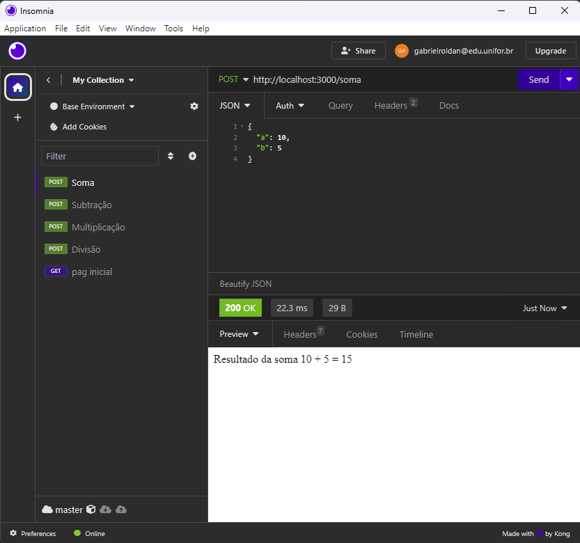
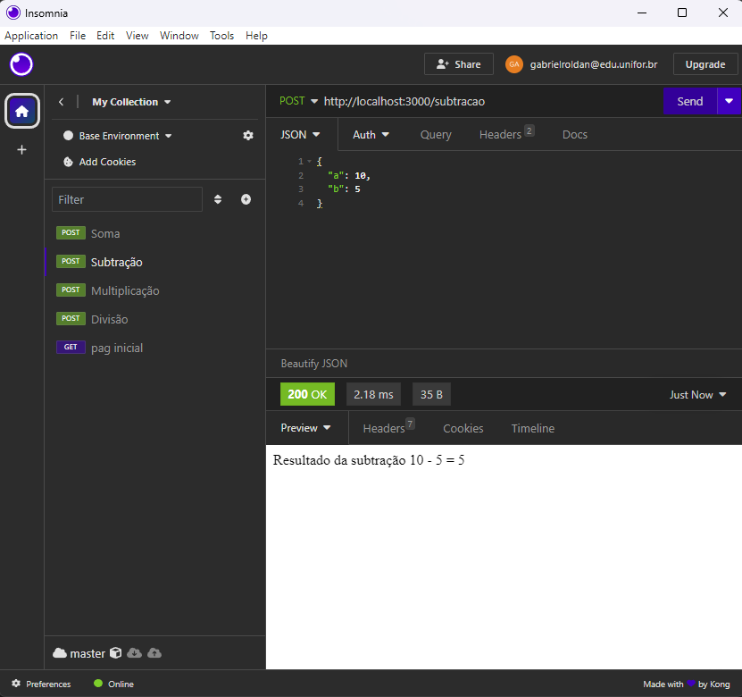
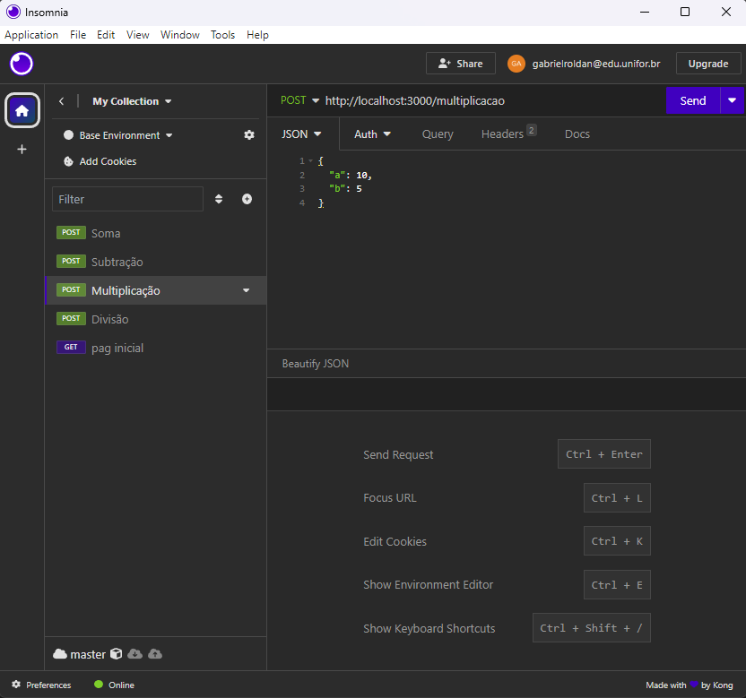

# Ambiente-Unifor

## Entregavel-03 // <a href="https://github.com/gabrielroldann/Ambiente-Unifor/tree/main/Entregavel03">Arquivo do entregavel 03</a>

- <a href="#Página-Inicial">Print Página Inicial</a>
- <a href="#Post-Soma">Print Soma</a>
- <a href="#Post-Subtração">Print Subtração</a>
- <a href="#Post-Divisão">Print Divisão</a>

# Página-Inicial

# Post-Soma

# Post-Subtração

# Post-Multiplicação

# Post-Divisão

